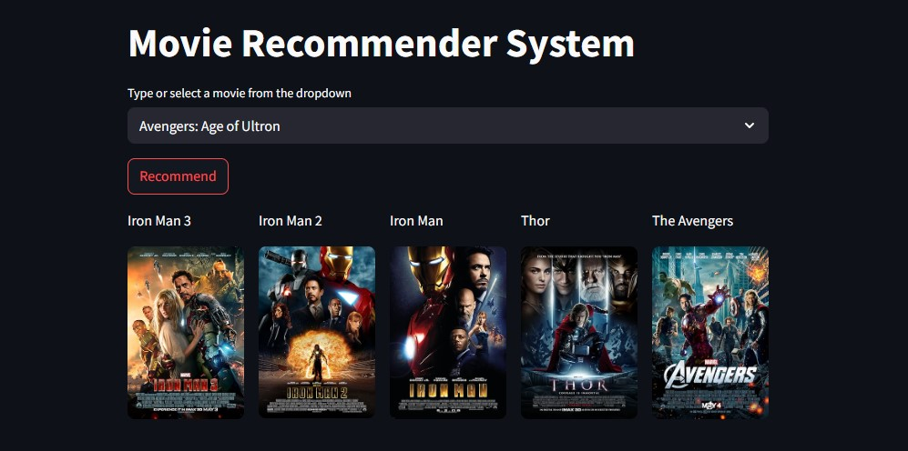

# 🎬 Movie Recommender System using Machine Learning


Recommendation systems have become essential in today’s fast-paced world, where users are constantly overwhelmed with choices and limited time. These systems help users make informed decisions by providing personalized suggestions, reducing decision fatigue.

This project showcases a **Movie Recommendation System** that utilizes **Machine Learning** techniques to recommend movies based on user preferences. It uses content-based filtering and is deployed as a Streamlit web app for easy interaction.

---

## 📌 About This Project

This Streamlit web application recommends similar movies based on a user's selection or interest. It uses a pre-trained model (`similarity.pkl`) built using cosine similarity and text vectorization techniques.

🔗 **[Live Demo](https://movie-recommender-system-6ahc.onrender.com)**

---

## 📊 Types of Recommendation Systems

### 1. Content-Based Filtering

- Utilizes item attributes (e.g., genre, director, cast) to make recommendations.
- Works by analyzing the similarity between content items.
- Examples: YouTube, Spotify (e.g., artist similarity).
- Embeds features to generate a vector for each item.
- Pros:
  - Personalized recommendations.
  - Effective with limited user interaction.
- Cons:
  - Over-specialization (limited diversity).
  - Doesn’t explore beyond familiar categories.

### 2. Collaborative Filtering

- Based on user-item interaction (e.g., ratings).
- Recommends items that similar users liked.
- Examples: Netflix, Amazon.
- Pros:
  - No need for metadata.
  - Can find unexpected interests.
- Cons:
  - Cold-start problem for new users/items.
  - Sparse and large user-item matrix.
  - Bias towards popular items.

### 3. Hybrid Filtering

- Combines both content-based and collaborative approaches.
- Helps mitigate weaknesses of individual methods.
- Widely used in modern systems (e.g., word2vec + similarity metrics).

---

## 🧠 Core Concept: Cosine Similarity

The core engine of this system is built on **Cosine Similarity**.

- Measures the cosine of the angle between two vectors.
- Output ranges from `0` (completely dissimilar) to `1` (completely similar).
- Effective for comparing text data like movie overviews and metadata.

🔗 [Learn more about cosine similarity](https://www.learndatasci.com/glossary/cosine-similarity/)

---

## 📁 Dataset Used

TMDB 5000 Movie Dataset from Kaggle  
🔗 [View Dataset](https://www.kaggle.com/tmdb/tmdb-movie-metadata?select=tmdb_5000_movies.csv)

---

## 📷 Demo Screenshots



---

## 🛠️ Tech Stack

- Python 3.7.10
- Pandas, NumPy
- Scikit-learn
- Streamlit
- Cosine Similarity (from sklearn)

---

## 💻 How to Run the Project Locally

### Step 1: Clone the Repository

```bash
git clone https://github.com/entbappy/Movie-Recommender-System-Using-Machine-Learning.git
cd Movie-Recommender-System-Using-Machine-Learning
```

```bash
conda create -n movie python=3.7.10 -y
```

```bash
conda activate movie
```


### STEP 02- install the requirements
```bash
pip install -r requirements.txt
```


```bash
#run this file to generate the models

Movie-Recommender-System-Data-Analysis.ipynb
```

Now run,
```bash
streamlit run app.py
```

